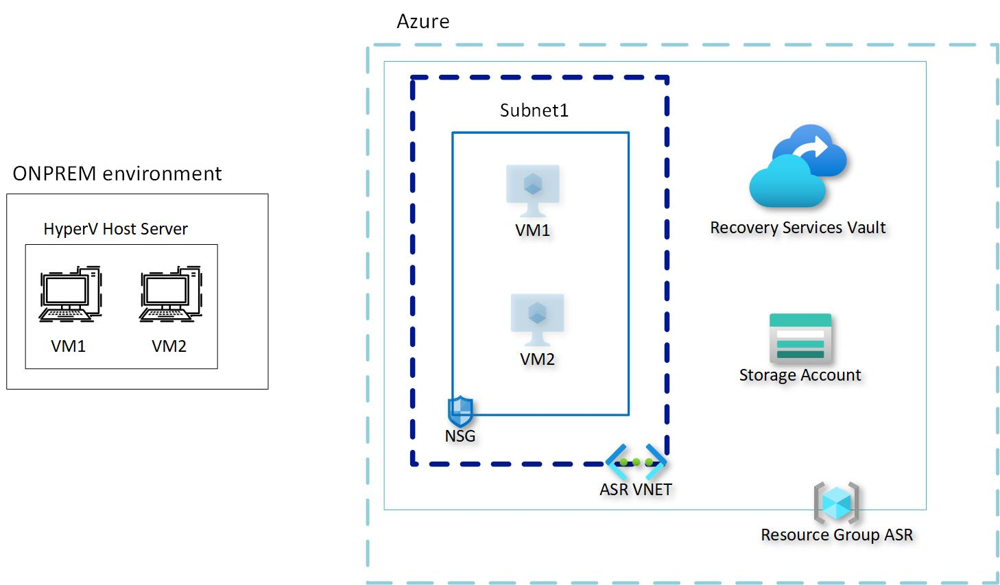

# ASR HyperV Landing Zone

This project is intended to get you started with a basic deployment of Azure prerequisites to use ASR with your Hyper V host. Feel free to modify this template given your own needs. Here is the architecture that we are going to deploy:

The template called **template.json** is intended to deploy the following resources:
- Storage Account without Soft delete enabled as required for ASR
- Virtual Network where the VMs will land after replication: change address space as per your own needs
- Network Security Group attached to the VNET subnet (default). Currently it has RDP port opened for a specific public IP
- Recovery Services Vault that is going to be used as the primary vault for replication to happen

## Important documentation
Make sure to check the following documentation when planning on ASR for Hyper V. The JSON template is intended to simplify steps 1 - 3

### ARCHITECTURE
https://docs.microsoft.com/en-us/azure/site-recovery/hyper-v-azure-architecture

### REQUIREMENTS without VMM
1. Deploy a Recovery Services Vault Prepare Azure for on-premises disaster recovery with https://docs.microsoft.com/en-us/azure/site-recovery/tutorial-prepare-azure#create-a-recovery-services-vault
2. Set up an Azure Network: where the VMs will land once failover is done: Prepare Azure for on-premises disaster recovery with https://docs.microsoft.com/en-us/azure/site-recovery/tutorial-prepare-azure#set-up-an-azure-network
3. Create a Storage Account that does not have Soft Delete enabled
4. Review you meet prerequisites for supported configuration: https://docs.microsoft.com/en-us/azure/site-recovery/hyper-v-azure-support-matrix#on-premises-servers
5. Verify Internet access: https://docs.microsoft.com/en-us/azure/site-recovery/hyper-v-prepare-on-premises-tutorial#verify-internet-access
6. Think and prepare how you will connect to the replicated VMs: https://docs.microsoft.com/en-us/azure/site-recovery/hyper-v-prepare-on-premises-tutorial#prepare-to-connect-to-azure-vms-after-failover
7. Follow the next steps: https://docs.microsoft.com/en-us/azure/site-recovery/hyper-v-azure-tutorial
8. Test failover: https://docs.microsoft.com/en-us/azure/site-recovery/tutorial-dr-drill-azure
9. Do failover: https://docs.microsoft.com/en-us/azure/site-recovery/hyper-v-azure-failover-failback-tutorial

 
### REQUIREMENTS with VMM

1. Deploy a Recovery Services Vault Prepare Azure for on-premises disaster recovery with https://docs.microsoft.com/en-us/azure/site-recovery/tutorial-prepare-azure#create-a-recovery-services-vault
2. Set up an Azure Network: where the VMs will land once failover is done: Prepare Azure for on-premises disaster recovery with https://docs.microsoft.com/en-us/azure/site-recovery/tutorial-prepare-azure#set-up-an-azure-network
3. Create a Storage Account that does not have Soft Delete enabled
4. Review you meet prerequisites for supported configuration: https://docs.microsoft.com/en-us/azure/site-recovery/hyper-v-azure-support-matrix#on-premises-servers
5. Prepare VMM for the failover, network mapping:
   
   i. Make sure you have a VMM **logical network** associated with the cloud in which Hyper V hosts are located: https://docs.microsoft.com/en-us/system-center/vmm/network-logical?view=sc-vmm-2019
   
   ii. Ensure you have a **VM network** linked to the **logical network**: https://docs.microsoft.com/en-us/system-center/vmm/network-virtual?view=sc-vmm-2019
   
   iii. Connect the VMs to the **VM network**
   
6. Think and prepare how you will connect to the replicated VMs: https://docs.microsoft.com/en-us/azure/site-recovery/hyper-v-prepare-on-premises-tutorial#prepare-to-connect-to-azure-vms-after-failover
7. Follow the next steps: https://docs.microsoft.com/en-us/azure/site-recovery/hyper-v-vmm-azure-tutorial
8. Test failover: https://docs.microsoft.com/en-us/azure/site-recovery/tutorial-dr-drill-azure
9. Do failover: https://docs.microsoft.com/en-us/azure/site-recovery/hyper-v-azure-failover-failback-tutorial

