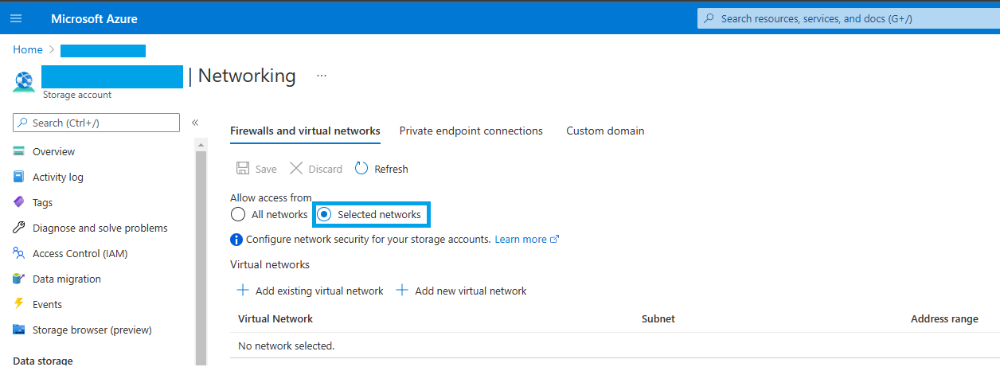
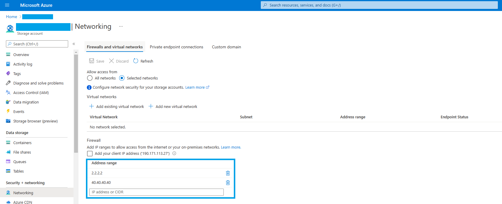
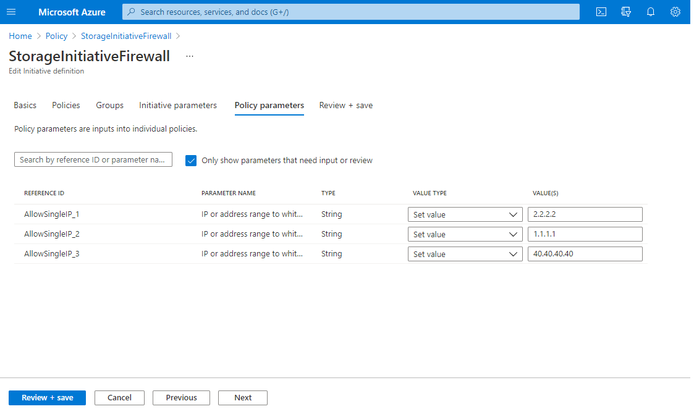

# Storage Firewall

Storage Firewall is available for Storage Accounts in order to limit the IP addresses that have access to the information stored on the storage. Here is some documentation on how it works: https://docs.microsoft.com/en-us/azure/storage/common/storage-network-security?tabs=azure-portal

The two policies here are intended to simplify the implementation of the Storage Firewall. Here is a summary of their funtionallity:

 -  MandatoryFirewall.json: Creates a policy that does not allow to create public storage accounts. The storage account firewall needs to be enabled since the moment of the creation and cannot be turned off once the account exists

 
 -  AllowSingleIP.json: Receives a parameter that will be either a single IP or an address range and it will be added to the whitelist of the Firewall. You will not be able to remove the IP selected from the firewall, it will be enforced with the policy. You will be able to add additional IPs in case they are needed individually.Take into account that this policy adds only 1 IP at a time. For adding multiple IPs continue reading on the Policy section: Policy Initiative section of this document.

# How to deploy and assign policies
 
There are three main concepts about policies on Azure that need to be clear in order to use them correctly for your resources:

 ## Policy Definition
 A policy definition contains the code for a single policy. It can be either Built-in (provided by Azure) or Custom, like the ones we are creating here. You can create a policy definition by following the steps on this documentation, it includes both Azure Portal and CLI/API/PowerShell deployment: 

https://docs.microsoft.com/en-us/azure/governance/policy/tutorials/create-and-manage#implement-a-new-custom-policy

## Policy Initiative Definition

A group that contains several policy definitions. For instance, if you want to use both of the policies mentioned above at the same time you can create a Policy Initiative that contains both in order to group them together. 

With the policy initiative we will also be able to create the whole list of IPs that we will like to whitelist on the firewall since we can call several instances of the same policy definition (one per IP or address range that you will like to include). Here is the docs on how to create one: 

https://docs.microsoft.com/en-us/azure/governance/policy/tutorials/create-and-manage#create-and-assign-an-initiative-definition

## Policy Assignment

Create a new assignment of the policy to choose which resources will be enforced to use the policy: you can choose either the whole susbscription or an specific resource group. You can choose to assign individual policies or policy initiative definitions depending on your needs. Refer to this documentation as well to create a policy assignment:

https://docs.microsoft.com/en-us/azure/governance/policy/tutorials/create-and-manage#create-and-assign-an-initiative-definition

Once the policy is assigned to the desired scope be patient! It might take up to 30 minutes for it to apply. Once applied, you can verify the compliance of your resources. Here you can find more information on how compliance is evaluated:

https://docs.microsoft.com/en-us/azure/governance/policy/how-to/get-compliance-data

# Suggested steps to test these policies

This is a series of steps that I suggest for you to test these policies:

1. Create the Policy Definition on your subscription for both policies 
2. Create an Initiative Definition that contains 1 instance of MandatoryFirewall.json policy and 3 instances of AllowSingleIP.json. On the Policy Parameters tab you will be able to choose the list of IPs or address ranges that you will like to whitelist: 
3. Create an empty resource group
4. Assign the Policy Initiative to the resource group you created on step 3
5. Create a storage account under the Resource Group. You will notice you cannot create it unless you enable the storage firewall
6. Once the storage account is created, check the Networking tab and verify that the IPs you added as parameters are there. You can try to delete any of those IPs and verify that it will be added back again automatically
7. On the resource group, you can go to policies tab to check if the storage account is complient with your policies or not (remember this might take time)

Congratulations! You have now two custom policies that allow you to set up your storage account firewall based on your requirements!
